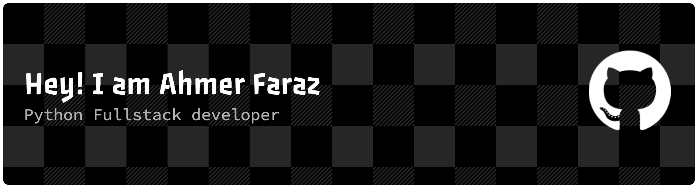

  

## Who I Am

I'm a Python Full Stack Developer at **Yudiz Solutions Ltd** (Ahmedabad, India) with experience in building API-first, cloud-ready systems. My work spans production SaaS platforms, IoT-connected products, and — more recently — AI-driven applications built on LLMs. I care most about solution architecture: turning a business requirement into something modular, secure, and easy to maintain Product.

`Python Full Stack Developer` · `Yudiz Solutions Ltd` · `Ahmedabad, India`

## Quick Facts

| | |
|---|---|
| **Current Focus** | AI-driven apps with LLMs (GPT, Claude, open-source models), chatbots, intelligent automation |
| **Backend** | Python — Django, Flask, FastAPI — modular, API-first architecture |
| **Cloud** | AWS (EC2, ECS, Lambda, API Gateway, S3, RDS) and Google Cloud |
| **Async & Messaging** | Redis (queues, caching, pub/sub), Celery, event-driven pipelines |
| **Security** | RBAC, JWT/OAuth authentication, encryption, secure system design |

## Tech Stack

**Languages**

  
  
  
  
  

**Backend & APIs**

  
  
  
  
  
  
  

**Cloud & Infrastructure**

  
  
  
  
  
  
  
  
  

**Data & Databases**

  
  
  
  
  

**AI & Machine Learning**

  
  
  
  
  

**Automation & Integrations**

  
  
  
  

**Tools**

  
  
  
  

## Featured Projects

<table>
<tr>
<td width="33%" valign="top">

**PA360**

Multi-role platform for asset, reminder, and document management.

- Django REST Framework APIs
- Deployed on AWS EC2 + S3
- Event-driven reminders & notifications
- Payment gateway & calendar API integrations

</td>
<td width="33%" valign="top">

**Swigable**

Backend for a smart water bottle app tracking hydration in real time.

- REST APIs for consumption logs & analytics
- Real-time IoT device ↔ mobile sync
- Redis-backed async data aggregation
- Query & API performance optimization

</td>
<td width="33%" valign="top">

**Conceptualize AI**

B2C ML platform generating unseen product image variations for manufacturers and artists.

- GAN-based generation (Django + TensorFlow)
- Numpy-driven data pipelines
- Plan-based compute allocation
- PayPal billing integration

</td>
</tr>
</table>

## GitHub Stats

  
  

## Connect With Me

  
  
  

